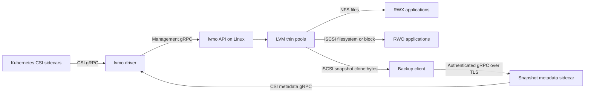
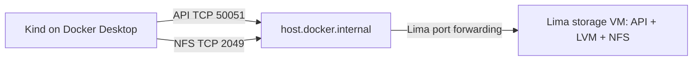

# lvmo-csi

This project was initially generated by OpenAI Codex from the [initial prompt](initial-prompt.md). I, the developer, review the code and define the tests. I also use Claude to update it.

**This project is experimental. It has never been tested in production: for now, use it only for non-critical workloads. No support is provided if you run into an issue.**

## Goals

This project has three goals.

### Ramping up on CSI storage for Kubernetes

I, the author (Michael Courcy), wanted to dive deep into the CSI landscape, and this project was a fantastic opportunity. For the moment, see it as a personal project rather than a community project.

### Easy-to-operate storage for Kubernetes in the datacenter

lvmo aims to deliver what the storage server's disks can do, shared fairly between volumes. Size the server's disks, CPU and network, and you know what the workloads will get. The evidence for this statement is in our [performance tests](./docs/performances-test.md).

This project is anything but creative: it relies on very well-known technologies, NFS, iSCSI and LVM. What it does is integrate them so that your storage specialists can build and run the storage server, while on the Kubernetes side you only deploy the driver's Helm chart and configure your storage classes.

lvmo's place is not the hyperscalers (even if they are handy for testing), but the datacenter and the edge.

### Optimized for Kasten

lvmo is designed with Kasten by Veeam in mind. Snapshots in an LVM thin pool are very light and quick to create and delete, which shortens exports. The same is true for clones.

It also implements KEP-3314 (changed block tracking), so that block-mode exports can be incremental. Even an NFS volume can be exported in block mode.

## Architecture

LVM thin volumes for Kubernetes, exported over NFS or iSCSI through one CSI driver (`lvmo.csi.io`). Every PVC gets its own logical volume. NFS supports RWX filesystems; iSCSI supports RWO ext4/XFS filesystems and raw block devices. Snapshots and clones use LVM thin snapshots. The CSI SnapshotMetadata service exposes allocated and changed block ranges for KEP-3314.

This is an initial implementation for evaluation. Each volume resides on one storage server, with no replication or automatic failover. One driver installation can manage multiple servers. Kasten consumption of the metadata service is **not validated** for the moment.




The metadata path supplies byte ranges; the iSCSI clone supplies the corresponding bytes. Ordinary filesystem backups use filesystem clones and do not require the metadata sidecar.

### Why thin pools?

**Each PVC gets its own real logical volume (LV), with its own block device and capacity.** Filesystem volumes also have their own filesystem. You create a thin pool once during storage-server setup; the driver then creates each PVC's thin LV inside that pool automatically.

```text
Volume group: lvmo-data
└── Thin pool: lvmo-pool — shared backing storage
    ├── PVC A → its own thin LV → its own filesystem
    ├── PVC B → its own thin LV → its own filesystem
    └── PVC C → its own thin LV → raw block device
```

The pool is a special LVM logical volume that supplies physical blocks to these individual volumes. It is not a shared filesystem containing all PVCs as directories.

| Allocation model | What a 10 GiB PVC reserves |
| --- | --- |
| Traditional (thick) LV | 10 GiB of backing storage immediately from the volume group |
| Thin LV | A 10 GiB logical device; backing blocks are allocated from the pool as writes occur, including filesystem initialization |

We use thin LVs for three related capabilities:

- **Space allocation on demand:** each PVC has its own size limit without reserving its full capacity immediately.
- **Snapshots and clones:** an LVM thin snapshot initially shares its source's blocks. Subsequent writes allocate separate blocks, preserving the snapshot's contents without copying the entire volume.
- **Changed-block tracking:** the driver compares mappings from thin-pool metadata to identify allocated and changed byte ranges for CSI SnapshotMetadata, without scanning the entire volume's contents. See [metadata semantics](docs/metadata.md).

One thick LV per PVC is a valid storage design, but this driver requires thin pools. Supporting thick LVs would require a different implementation for snapshots, clones, and changed-block tracking.

The tradeoff is shared physical capacity: the sum of PVC sizes can exceed the pool's data capacity, and snapshots retain blocks that might otherwise be reclaimed. Monitor both pool data and metadata usage and extend the pool before either fills. A PVC's declared size does not guarantee that much free space in the pool; pool exhaustion can affect every volume using it.

## Build

Requires Go 1.26.3. Development scripts target macOS Apple Silicon with Lima, Kind, Helm, kubectl, and Docker CLI.

```sh
make build                    # Linux ARM64 executables in bin/
make test lint                # unit tests/race detector, vet, Helm lint
make release-binaries VERSION=v0.1.0  # Linux AMD64/ARM64 + SHA256SUMS
```

Generated bindings are committed. To regenerate, install `protoc`, `protoc-gen-go@v1.36.11`, and `protoc-gen-go-grpc@v1.5.1`, then run `make generate`.

## Storage server

Use a dedicated Linux server (tested with Ubuntu 24.04) with one or more VGs, each holding a thin pool named `lvmo-pool`, and run the lvmo API on it:

```sh
sudo lvcreate --type thin-pool -L 100G --chunksize 64k --poolmetadatasize 1G -n lvmo-pool my-vg
sudo ./bin/lvmo-csi --server=10.0.0.10 -P 50051 my-vg
```

The server deliberately does not repartition disks, create VGs, or size the pool. Restrict management TCP/50051, NFS TCP/2049, and iSCSI TCP/3260 to trusted cluster nodes: the management API and iSCSI targets have no authentication, and NFS exports use `no_root_squash`.

[Build a storage server](docs/storage-server.md) is the step-by-step guide: sizing the disks, CPU, memory and network from the performance tests, packages, LVM filter, thin pool, the systemd unit and the API's options, NFS tuning, firewall, monitoring the pool, verification, adding capacity, backup and upgrade.

The API persists operation intents and deletion tombstones atomically. Incomplete creates are reclaimed by a background worker, allowing retries. Deleted NFS exports may retain kernel references temporarily; physical LV reclamation is retried. Only one API process may own a state directory.

## Kubernetes / OpenShift

Install the VolumeSnapshot CRDs and snapshot controller separately if your distribution does not already provide them. The chart does not own those prerequisites, StorageClasses, or VolumeSnapshotClasses.

```sh
helm upgrade --install lvmo charts/lvmo-csi -n lvmo-system --create-namespace \
  --set image.tag=v0.1.0
# Add --set openshift=true on OpenShift to install the driver's SCC.
kubectl apply -f tests/storageclasses.yaml  # example only: edit endpoint and VG names first
```

Each real Kubernetes node needs a running host `iscsid`, an initiator name in `/etc/iscsi/initiatorname.iscsi`, NFS client support, and network access to the server. The privileged node plugin mounts host devices and the kubelet directory. `iscsiHostProc` is exclusively for nested Kind testing; leave it empty on real nodes.

StorageClass parameters: `endpoint` (required API host:port), `protocol` (`nfs`, default, or `iscsi`), `vg` (required with multiple VGs on that server), and `filesystem` (`ext4`, default, or `xfs`). One driver installation can manage several storage VMs:

```yaml
parameters:
  endpoint: storage-a.example.internal:50051
  protocol: iscsi
  vg: data
```

A second class can use `storage-b.example.internal:50051`. The endpoint selects the management API; that API supplies the NFS/iSCSI data address. CSI volume and snapshot handles retain their API endpoint, so node operations, expansion, deletion, restores, and CBT requests still route correctly after a driver restart. Use stable DNS names: changing a StorageClass does not retarget existing handles. The endpoint is also visible in the PV's `spec.csi.volumeAttributes.endpoint`.

The driver discovers backends for listing from StorageClasses, PV handles, and retained VolumeSnapshotContent handles. An unavailable backend returns an error for its operations; it does not prevent the driver from starting or provisioning against another backend. A combined list fails rather than silently omitting an unavailable backend. For restores across protocols, both classes must select the same canonical API endpoint, VG, and driver identity. Cross-server LVM cloning is not supported. The Helm `apiEndpoint` value is now only an optional fallback for legacy unqualified handles or standalone CSI tests.

iSCSI volumes are single-node. The driver uses Kubernetes' attach step: attaching a volume to a node adds that node's iSCSI initiator to the target's access list, and only listed initiators can log in. A node ID therefore carries the node's initiator name (`lvmo:<node>:<initiator>`). Staging also takes a persistent, exclusive node lease on the storage server. NFS volumes retain multi-node access and attach without doing anything.

When a node fails, apply the standard `node.kubernetes.io/out-of-service=nodeshutdown:NoExecute` taint once it is confirmed down. Kubernetes then deletes its pods and detaches its volumes: detaching removes the failed node's initiator from the target, which closes its sessions and refuses its later logins, so another node can safely take over. Remove the taint when the node is back.

Without a taint, lvmo fails over by itself (chart value `failover.enabled`, on by default). Each node plugin sends a heartbeat to every storage server every 10 seconds. When Kubernetes has reported a node not Ready **and** the storage servers have not heard from it, both for `failover.timeout` (default `120s`), the controller asks the storage servers to fence the node, then force-deletes its pods that use lvmo volumes. A storage server refuses to fence a node it heard from within the timeout, so a node that is only partly cut off is never fenced. Kubernetes then reschedules the pods and detaches the volumes from the dead node after its 6-minute forced-detach timeout: expect the workload back about 9 minutes after the failure. NFS volumes are moved the same way but cannot be fenced. Set `failover.enabled=false` to rely on the taint alone.

**Upgrading an installation created before the attach step** (`v0.1.0-alpha.2` or earlier): Kubernetes does not allow changing `attachRequired` on an existing CSIDriver object. Delete it before upgrading (`kubectl delete csidriver lvmo.csi.io`), then run `helm upgrade` with `--reset-then-reuse-values` so the new `csi-attacher` sidecar image is picked up. Existing pods keep running; their volumes are attached to their nodes the next time they are staged.

## Backups and changed block tracking

Ordinary filesystem snapshot restores remain the default. The optional block path creates an iSCSI `volumeMode: Block` PVC from a snapshot, including snapshots of NFS PVCs. It preserves the filesystem's raw bytes and never formats or mounts the backup clone. The VolumeSnapshotContent must permit filesystem-to-block conversion with `snapshot.storage.kubernetes.io/allow-volume-mode-change: "true"`.

See [validated capabilities and limits](docs/validation.md) and [metadata deployment and semantics](docs/metadata.md) for TLS, RBAC, discovery, independent verification, and Kasten configuration boundaries.

## Deploy on your laptop: Kind with a separate Lima storage VM

This walkthrough installs a released driver into **Kind on Docker Desktop**, with **Lima used only as the storage server**. Kubernetes pulls `michaelcourcy/lvmo-csi` from Docker Hub. You do not need Go, a source checkout, or the project's test scripts.



The walkthrough creates an NFS RWX PVC, writes data, and restores a snapshot. It targets macOS Apple Silicon. The separate Docker Desktop/Lima topology has not yet been validated end to end; the earlier automated results used Kind inside Lima.

**Release artifacts:** `michaelcourcy/lvmo-csi:v0.1.0-alpha.2` is published on Docker Hub for Linux AMD64 and ARM64. The matching [GitHub release](https://github.com/michaelcourcy/lvmo-csi/releases/tag/v0.1.0-alpha.2) provides the Linux API binaries, checksums, and Helm chart used below.

### 1. Create the environment

Follow the **Create** section of [tests/environments/lima.md](tests/environments/lima.md). It prepares the laptop, creates the Lima storage VM with its loop-backed pool and API, creates Kind, and installs the snapshot controller, the released driver, the `lvmo-nfs` StorageClass and the `lvmo-snapshots` VolumeSnapshotClass. Keep the same terminal afterwards: the following steps reuse its `KUBECONFIG`, `LVMO_VM` and `LVMO_CLUSTER` variables.

### 2. Write data to an NFS RWX PVC

The storage API runs with `--nfs-insecure` because of Lima's port forwarding; [lima.md](tests/environments/lima.md) explains why.

Create the PVC and pod:

```sh
kubectl create namespace lvmo-demo
kubectl -n lvmo-demo apply -f - <<'YAML'
apiVersion: v1
kind: PersistentVolumeClaim
metadata:
  name: data
spec:
  storageClassName: lvmo-nfs
  accessModes: [ReadWriteMany]
  resources:
    requests:
      storage: 1Gi
---
apiVersion: v1
kind: Pod
metadata:
  name: writer
spec:
  containers:
  - name: app
    image: busybox:1.37
    command: [sh, -c, 'sleep 86400']
    volumeMounts:
    - name: data
      mountPath: /data
  volumes:
  - name: data
    persistentVolumeClaim:
      claimName: data
YAML
kubectl -n lvmo-demo wait --for=condition=Ready pod/writer --timeout=180s
kubectl -n lvmo-demo exec writer -- sh -c 'echo "hello from lvmo" > /data/message; sync'
kubectl -n lvmo-demo exec writer -- cat /data/message
kubectl -n lvmo-demo get pvc
```

Expect a `Bound` PVC and the message `hello from lvmo`. To inspect the backend selected for the volume:

```sh
PV=$(kubectl -n lvmo-demo get pvc data -o jsonpath='{.spec.volumeName}')
kubectl get pv "$PV" -o jsonpath='{.spec.csi.volumeAttributes.endpoint}{"\n"}{.spec.csi.volumeHandle}{"\n"}'
```

### 3. Snapshot, restore, and verify the data

The demo has no active writer after the preceding `sync`. Applications with concurrent writes need their own quiescing or application-consistent backup procedure.

```sh
kubectl -n lvmo-demo apply -f - <<'YAML'
apiVersion: snapshot.storage.k8s.io/v1
kind: VolumeSnapshot
metadata:
  name: data-snapshot
spec:
  volumeSnapshotClassName: lvmo-snapshots
  source:
    persistentVolumeClaimName: data
YAML
kubectl -n lvmo-demo wait --for=jsonpath='{.status.readyToUse}'=true volumesnapshot/data-snapshot --timeout=180s
kubectl -n lvmo-demo exec writer -- sh -c 'echo "changed after snapshot" > /data/message; sync'

kubectl -n lvmo-demo apply -f - <<'YAML'
apiVersion: v1
kind: PersistentVolumeClaim
metadata:
  name: restored
spec:
  storageClassName: lvmo-nfs
  accessModes: [ReadWriteMany]
  resources:
    requests:
      storage: 1Gi
  dataSource:
    apiGroup: snapshot.storage.k8s.io
    kind: VolumeSnapshot
    name: data-snapshot
---
apiVersion: v1
kind: Pod
metadata:
  name: reader
spec:
  containers:
  - name: app
    image: busybox:1.37
    command: [sh, -c, 'sleep 86400']
    volumeMounts:
    - name: data
      mountPath: /data
  volumes:
  - name: data
    persistentVolumeClaim:
      claimName: restored
YAML
kubectl -n lvmo-demo wait --for=condition=Ready pod/reader --timeout=180s
kubectl -n lvmo-demo exec reader -- cat /data/message
kubectl -n lvmo-demo exec writer -- cat /data/message
```

The restored PVC should contain `hello from lvmo`; the original should contain `changed after snapshot`.

### 4. Troubleshoot and remove the installation

Run these diagnostics from the laptop:

```sh
kubectl -n lvmo-demo get pvc,pods,volumesnapshots
kubectl -n lvmo-demo describe pod writer
kubectl -n lvmo-system logs deployment/lvmo-controller -c driver --tail=100
kubectl -n lvmo-system logs daemonset/lvmo-node -c driver --tail=100
kubectl get events -A --sort-by=.lastTimestamp
limactl shell "$LVMO_VM" sudo journalctl -u lvmo-api --no-pager -n 100
limactl shell "$LVMO_VM" sudo lvs
```

`ImagePullBackOff` requires checking the published tag and registry access. A pending PVC calls for checking the StorageClass API endpoint; a bound PVC with a pod stuck mounting calls for checking NFS connectivity on port 2049 and the node's kernel support. Docker Desktop/Lima forwarding and sleep/wake can affect connections; this is a laptop lab, not a highly available storage deployment.

To remove the demo, delete its resources while the CSI driver and storage VM are still running:

```sh
kubectl delete namespace lvmo-demo --wait=true --timeout=180s
kubectl get pv
kubectl get volumesnapshotcontent
```

Wait for this demo's PVs and snapshot contents to disappear. NFS delegations can delay physical LV reclamation after Kubernetes resources disappear; inspect `lvs` and the API logs if needed. See [the known reclamation limitation](docs/validation.md).

Then remove the cluster and the storage VM with the **Delete** section of [tests/environments/lima.md](tests/environments/lima.md). This destroys all data in this lab.

### About iSCSI and block backups on this topology

The driver also supports iSCSI and NFS-snapshot-to-block backup clones. Those paths additionally require a working iSCSI initiator and kernel support on each Kind node. On macOS, that kernel belongs to Docker Desktop, not Lima; installing `iscsid` on the storage VM does not supply the initiator for Kind. This guide therefore demonstrates NFS and ordinary filesystem snapshot restores. iSCSI/CBT on this separate Docker Desktop/Lima layout remains unvalidated; do not interpret the nested-Lima test results as validation of this layout. See [metadata deployment](docs/metadata.md) for the backup service requirements.

## Developer end-to-end tests

These commands are for contributors. They build local code and use a different topology (Kind inside Lima); they are not part of the release-based deployment guide above.

```sh
scripts/e2e.sh                                   # local; every automated scenario, one setup/teardown
scripts/e2e.sh local basic                       # a group
scripts/e2e.sh local csi-sanity cbt-metadata-endpoint   # individual scenarios
scripts/e2e.sh azure                             # active subscription + current OpenShift context
RELEASE_VERSION=v0.1.0 scripts/e2e.sh local cbt
```

Arguments are scenario ids or groups from [tests/scenarios](tests/scenarios/); see [AGENTS.md](AGENTS.md) for the scenario format, groups and environments. The former suite names `sanity`, `external`, `snapshots` and `metadata` still work. Local runs create a uniquely named Lima VM, two loop-backed VGs, and Kind inside that VM. They do not change the host kubeconfig. `KEEP_TEST_ENV=true` retains a local VM for debugging. Reports are copied into `.test/reports` before teardown. The cleanup audit always runs last. Upstream external tests exclude disruptive, serial, slow, stress, and performance tests; unsupported capability cases are skipped by upstream.

Azure runs discover the current cluster's subnet, create a separate tagged resource group and Ubuntu VM, install this driver, and remove their resources afterward. They skip `backend-routing`, which needs the cluster to be reachable from the storage server. They refuse to overwrite an existing lvmo installation. `AZURE_SUBNET_ID` overrides subnet selection. Setup uses Azure VM Run Command and a private temporary blob container, so it does not require a public VM IP or SSH access. Use an isolated test cluster: the upstream suite needs cluster-wide test permissions. The in-cluster test runner uses a temporary service account; your kubeconfig is never copied to the VM. By default Azure tests build the locally compiled AMD64 driver in the OpenShift internal registry. Set `RELEASE_VERSION` to test published artifacts instead.

## Releases and license

`make image VERSION=v0.1.0` publishes both Linux architectures using the current Docker authentication. `scripts/install-release.sh v0.1.0` downloads and verifies GitHub release binaries. Pushing a `v*` tag runs the GitHub Actions release workflow, which publishes the binaries, chart and GitHub release, and pushes the image to `michaelcourcy/lvmo-csi`. It needs two repository secrets (Settings → Secrets and variables → Actions → Repository secrets): `DOCKERHUB_USERNAME`, a Docker Hub account allowed to push to that repository, and `DOCKERHUB_TOKEN`, a Docker Hub personal access token with Read & Write permission for that account. Local authenticated publishing does not require copying credentials into the repository.

Apache License 2.0: permissive reuse with an explicit patent grant.
