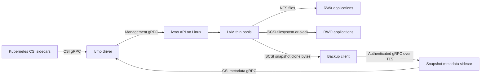

# lvmo-csi

LVM thin volumes for Kubernetes, exported over NFS or iSCSI through one CSI driver (`lvmo.csi.io`). Every PVC gets its own logical volume. NFS supports RWX filesystems; iSCSI supports RWO ext4/XFS filesystems and raw block devices. Snapshots and clones use LVM thin snapshots. The CSI SnapshotMetadata service exposes allocated and changed block ranges for KEP-3314.

This is an initial implementation for evaluation. Each volume resides on one storage server, with no replication or automatic failover. One driver installation can manage multiple servers. Kasten consumption of the metadata service is **not validated**.

## Architecture



The metadata path supplies byte ranges; the iSCSI clone supplies the corresponding bytes. Ordinary filesystem backups use filesystem clones and do not require the metadata sidecar.

## Build

Requires Go 1.26.3. Development scripts target macOS Apple Silicon with Lima, Kind, Helm, kubectl, and Docker CLI.

```sh
make build                    # Linux ARM64 executables in bin/
make test lint                # unit tests/race detector, vet, Helm lint
make release-binaries VERSION=v0.1.0  # Linux AMD64/ARM64 + SHA256SUMS
```

Generated bindings are committed. To regenerate, install `protoc`, `protoc-gen-go@v1.36.11`, and `protoc-gen-go-grpc@v1.5.1`, then run `make generate`.

## Storage server

Use a dedicated Linux server (tested with Ubuntu 24.04). Install `lvm2 thin-provisioning-tools nfs-kernel-server targetcli-fb open-iscsi xfsprogs`; enable NFS and the kernel LIO iSCSI target modules. Create a thin pool named `lvmo-pool` in each configured VG. The server deliberately does not repartition disks or create VGs in production.

```sh
sudo lvcreate --type thin-pool -L 100G --poolmetadatasize 1G -n lvmo-pool my-vg
sudo ./bin/lvmo-csi --server=10.0.0.10 -P 50051 my-vg
```

`lvmo-csi [-P port] VG...` automatically selects the local IPv4 address used by the default route. `--server` overrides the address Kubernetes nodes use for NFS/iSCSI; set it explicitly for multiple interfaces, NAT, or DNS-based access. `--root` defaults to `/var/lib/lvmo`; preserve this directory together with LVM metadata. `--pool` changes the thin pool name. `--nfs-clients` restricts the NFS export selector (default `*`). XFS requires a volume large enough for its minimum filesystem size (use at least 512Mi).

Restrict management TCP/50051, NFS TCP/2049, and iSCSI TCP/3260 to trusted cluster nodes. The management API and iSCSI targets intentionally have no authentication; NFS exports use `no_root_squash`. Do not expose these ports publicly. Monitor thin-pool data and metadata space: per-volume size enforcement does not reserve physical capacity, and pool exhaustion affects every volume sharing that pool. Configure LVM's devices file to include only backing PVs, particularly if the server is also an iSCSI initiator.

The API persists operation intents and deletion tombstones atomically. Incomplete creates are reclaimed by a background worker, allowing retries. Deleted NFS exports may retain kernel references temporarily; physical LV reclamation is retried. Only one API process may own a state directory.

## Kubernetes / OpenShift

Install the VolumeSnapshot CRDs and snapshot controller separately if your distribution does not already provide them. The chart does not own those prerequisites, StorageClasses, or VolumeSnapshotClasses.

```sh
helm upgrade --install lvmo charts/lvmo-csi -n lvmo-system --create-namespace \
  --set image.tag=v0.1.0
# Add --set openshift=true on OpenShift to install the driver's SCC.
kubectl apply -f tests/storageclasses.yaml  # example only: edit endpoint and VG names first
```

Each real Kubernetes node needs a running host `iscsid`, an initiator name in `/etc/iscsi/initiatorname.iscsi`, NFS client support, and network access to the server. The privileged node plugin mounts host devices and the kubelet directory. `iscsiHostProc` is exclusively for nested Kind testing; leave it empty on real nodes.

StorageClass parameters: `endpoint` (required API host:port), `protocol` (`nfs`, default, or `iscsi`), `vg` (required with multiple VGs on that server), and `filesystem` (`ext4`, default, or `xfs`). One driver installation can manage several storage VMs:

```yaml
parameters:
  endpoint: storage-a.example.internal:50051
  protocol: iscsi
  vg: data
```

A second class can use `storage-b.example.internal:50051`. The endpoint selects the management API; that API supplies the NFS/iSCSI data address. CSI volume and snapshot handles retain their API endpoint, so node operations, expansion, deletion, restores, and CBT requests still route correctly after a driver restart. Use stable DNS names: changing a StorageClass does not retarget existing handles. The endpoint is also visible in the PV's `spec.csi.volumeAttributes.endpoint`.

The driver discovers backends for listing from StorageClasses, PV handles, and retained VolumeSnapshotContent handles. An unavailable backend returns an error for its operations; it does not prevent the driver from starting or provisioning against another backend. A combined list fails rather than silently omitting an unavailable backend. For restores across protocols, both classes must select the same canonical API endpoint, VG, and driver identity. Cross-server LVM cloning is not supported. The Helm `apiEndpoint` value is now only an optional fallback for legacy unqualified handles or standalone CSI tests.

iSCSI staging takes a persistent, exclusive node lease; all iSCSI volumes are single-node. A different node cannot stage the volume until the previous node unmounts and releases it. There is no automatic failover or fencing of a failed host: before an operator releases a stranded lease through the management API, the old node must be stopped or otherwise prevented from accessing the target. NFS volumes retain multi-node access.

## Backups and changed block tracking

Ordinary filesystem snapshot restores remain the default. The optional block path creates an iSCSI `volumeMode: Block` PVC from a snapshot, including snapshots of NFS PVCs. It preserves the filesystem's raw bytes and never formats or mounts the backup clone. The VolumeSnapshotContent must permit filesystem-to-block conversion with `snapshot.storage.kubernetes.io/allow-volume-mode-change: "true"`.

See [validated capabilities and limits](docs/validation.md) and [metadata deployment and semantics](docs/metadata.md) for TLS, RBAC, discovery, independent verification, and Kasten configuration boundaries.

## End-to-end guide: Lima and Kind

This walkthrough uses the local source checkout on **macOS Apple Silicon**. The harness builds Linux ARM64 binaries, starts an Ubuntu Lima VM with 4 CPUs, 6 GiB RAM and a 40 GiB virtual disk, and runs Docker and a single-node Kind cluster inside it. Allow room for that virtual disk and container images. Internet access is needed to download packages and images.

### 1. Prepare the Mac

Install Go 1.26.3 and Lima, and ensure `go`, `limactl`, `make`, and `tar` are on your PATH. For example, with Homebrew already installed, `brew install lima` installs Lima. Run the following commands from the repository root:

```sh
go version
limactl --version
```

The scripts install Linux Kind, kubectl, Helm, Docker image dependencies, and the storage packages inside the VM. Docker Desktop, a Docker Hub login, a published release, and host Kubernetes credentials are not required for this source-based workflow. The driver image is built inside Lima and loaded directly into Kind.

### 2. Create and keep the test environment

```sh
KEEP_TEST_ENV=true scripts/e2e.sh local sanity snapshots
```

This builds the binaries and test executables, copies the checkout into `/tmp/lvmo-src` in a new `lvmo-test-<timestamp>` VM, and installs:

- Two 8 GiB loop-backed test disks, VGs `lvmo-test1` and `lvmo-test2`, each with a 6 GiB thin pool.
- The storage API (`lvmo-api.service`) and a standalone CSI endpoint for sanity tests (`lvmo-driver.service`).
- Kind cluster `lvmo-e2e`, the CSI Helm release, snapshot CRDs and snapshot controller.
- StorageClasses `lvmo-nfs` and `lvmo-iscsi`, and VolumeSnapshotClass `lvmo-snapshots`.

It then runs sanity and snapshot-restore tests. These storage setup scripts are intended only for this disposable VM. At the end, copy the name printed after `Retained test VM:` into a variable on your Mac:

```sh
LVMO_VM=lvmo-test-<timestamp>  # replace with the actual name
limactl list
limactl shell "$LVMO_VM" sudo -i
```

**Run the commands in steps 3–6 in this root shell inside Lima.** The cluster kubeconfig is `/root/.kube/config`; the Mac's kubeconfig is unchanged. The VM is a disposable lab; delete and recreate it instead of relying on loop-device persistence across VM reboots.

### 3. Check the installation and backend address

```sh
export KUBECONFIG=/root/.kube/config
kubectl config current-context  # kind-lvmo-e2e
kubectl get nodes
kubectl -n lvmo-system get pods
kubectl get sc lvmo-nfs lvmo-iscsi -o yaml
kubectl get volumesnapshotclass lvmo-snapshots
systemctl --no-pager status lvmo-api
lvs -o vg_name,lv_name,lv_size,data_percent,metadata_percent
```

Both StorageClasses should contain `parameters.endpoint: 192.168.5.15:50051`, selecting the API on this default Lima network, and `vg: lvmo-test1`. No global Helm API endpoint is needed. In a multi-VM deployment, create separate StorageClasses with each VM's reachable API address. NFS and iSCSI classes used for a cross-protocol snapshot restore must select the same endpoint and VG.

The test chart sets `iscsiHostProc=/run/lvmo-host-proc` so nested Kind can use the outer VM's iSCSI daemon. This is a test setting; leave it empty on real Kubernetes nodes.

### 4. Write data to an NFS RWX PVC

```sh
kubectl create namespace lvmo-demo
kubectl -n lvmo-demo apply -f - <<'YAML'
apiVersion: v1
kind: PersistentVolumeClaim
metadata:
  name: data
spec:
  storageClassName: lvmo-nfs
  accessModes: [ReadWriteMany]
  resources:
    requests:
      storage: 1Gi
---
apiVersion: v1
kind: Pod
metadata:
  name: writer
spec:
  containers:
  - name: app
    image: busybox:1.37
    command: [sh, -c, 'sleep 86400']
    volumeMounts:
    - name: data
      mountPath: /data
  volumes:
  - name: data
    persistentVolumeClaim:
      claimName: data
YAML
kubectl -n lvmo-demo wait --for=condition=Ready pod/writer --timeout=180s
kubectl -n lvmo-demo exec writer -- sh -c 'echo "hello from lvmo" > /data/message; sync'
kubectl -n lvmo-demo exec writer -- cat /data/message
kubectl -n lvmo-demo get pvc
```

Expect a `Bound` PVC and the message `hello from lvmo`. To inspect the backend selected for the volume:

```sh
PV=$(kubectl -n lvmo-demo get pvc data -o jsonpath='{.spec.volumeName}')
kubectl get pv "$PV" -o jsonpath='{.spec.csi.volumeAttributes.endpoint}{"\n"}{.spec.csi.volumeHandle}{"\n"}'
```

### 5. Snapshot, restore, and verify the data

The demo has no active writer after the preceding `sync`. Applications with concurrent writes need their own quiescing or application-consistent backup procedure.

```sh
kubectl -n lvmo-demo apply -f - <<'YAML'
apiVersion: snapshot.storage.k8s.io/v1
kind: VolumeSnapshot
metadata:
  name: data-snapshot
spec:
  volumeSnapshotClassName: lvmo-snapshots
  source:
    persistentVolumeClaimName: data
YAML
kubectl -n lvmo-demo wait --for=jsonpath='{.status.readyToUse}'=true volumesnapshot/data-snapshot --timeout=180s
kubectl -n lvmo-demo exec writer -- sh -c 'echo "changed after snapshot" > /data/message; sync'

kubectl -n lvmo-demo apply -f - <<'YAML'
apiVersion: v1
kind: PersistentVolumeClaim
metadata:
  name: restored
spec:
  storageClassName: lvmo-nfs
  accessModes: [ReadWriteMany]
  resources:
    requests:
      storage: 1Gi
  dataSource:
    apiGroup: snapshot.storage.k8s.io
    kind: VolumeSnapshot
    name: data-snapshot
---
apiVersion: v1
kind: Pod
metadata:
  name: reader
spec:
  containers:
  - name: app
    image: busybox:1.37
    command: [sh, -c, 'sleep 86400']
    volumeMounts:
    - name: data
      mountPath: /data
  volumes:
  - name: data
    persistentVolumeClaim:
      claimName: restored
YAML
kubectl -n lvmo-demo wait --for=condition=Ready pod/reader --timeout=180s
kubectl -n lvmo-demo exec reader -- cat /data/message
kubectl -n lvmo-demo exec writer -- cat /data/message
```

The restored PVC should contain `hello from lvmo`; the original should contain `changed after snapshot`. For an iSCSI filesystem variant, use `lvmo-iscsi` and `ReadWriteOnce` in both PVC manifests in a fresh demo namespace. The automated snapshot suite covers both protocols.

### 6. Run backup and regression tests

First remove the demo so the test cleanup audit can require zero remaining volumes:

```sh
kubectl delete namespace lvmo-demo --wait=true --timeout=180s
cd /tmp/lvmo-src
bash scripts/run-suites.sh metadata
# Optional longer Kubernetes upstream NFS suite:
bash scripts/run-suites.sh external
```

The `metadata` suite tests full and incremental byte reconstruction for NFS, iSCSI filesystems, and raw block volumes; it also checks authentication, authorization, continuation, and discarded blocks. Its routing test creates a second API on port 50052 with a separate LVM pool, restarts the cluster driver, and verifies backup through that second backend. Both APIs run on the same VM in this test. This does not validate Kasten integration.

Alternatively, from the **Mac repository root**, run all suites in a new VM that is removed automatically:

```sh
scripts/e2e.sh local
```

A successful run ends with `Cleanup verified`. Read the final exit status as well as individual test results: NFS client delegations can delay physical deletion beyond the cleanup audit timeout, even when all functional tests pass. See [validation results and the known reclamation limitation](docs/validation.md).

### 7. Inspect failures and clean up

Inside Lima, useful diagnostics are:

```sh
kubectl -n lvmo-system logs deployment/lvmo-controller -c driver --tail=100
kubectl -n lvmo-system logs daemonset/lvmo-node -c driver --tail=100
kubectl get events -A --sort-by=.lastTimestamp
journalctl -u lvmo-api --no-pager -n 100
jq '{volumes:(.volumes|length),snapshots:(.snapshots|length),deleting:(.deleting|length)}' /var/lib/lvmo/state.json
```

The initial harness copies its reports to `.test/reports/<VM-name>.tgz` on the Mac. To collect reports from subsequent manual runs, then remove this lab, exit the root shell and run on the **Mac**:

```sh
exit
limactl shell "$LVMO_VM" sudo tar -czf /tmp/lvmo-reports.tgz -C /tmp/lvmo-src/.test reports
limactl copy "$LVMO_VM:/tmp/lvmo-reports.tgz" ".test/reports/$LVMO_VM-manual.tgz"
limactl delete --force "$LVMO_VM"
```

Deleting this VM removes its Kind cluster, loop-backed storage, and all demo data. Use the exact test VM name; other Lima instances are unrelated to this walkthrough.

## End-to-end tests

```sh
scripts/e2e.sh                         # local; all suites, one setup/teardown
scripts/e2e.sh local sanity snapshots  # select suites
scripts/e2e.sh local metadata          # real full/incremental reconstruction
scripts/e2e.sh azure                   # active subscription + current OpenShift context
RELEASE_VERSION=v0.1.0 scripts/e2e.sh local metadata
```

Suites are `sanity`, `external`, `snapshots`, and `metadata`. Local runs create a uniquely named Lima VM, two loop-backed VGs, and Kind inside that VM. They do not change the host kubeconfig. `KEEP_TEST_ENV=true` retains a local VM for debugging. Reports are copied into `.test/reports` before teardown. Upstream external tests exclude disruptive, serial, slow, stress, and performance tests; unsupported capability cases are skipped by upstream.

Azure runs discover the current cluster's subnet, create a separate tagged resource group and Ubuntu VM, install this driver, and remove their resources afterward. They refuse to overwrite an existing lvmo installation. `AZURE_SUBNET_ID` overrides subnet selection. Setup uses Azure VM Run Command and a private temporary blob container, so it does not require a public VM IP or SSH access. Use an isolated test cluster: the upstream suite needs cluster-wide test permissions. The in-cluster test runner uses a temporary service account; your kubeconfig is never copied to the VM. By default Azure tests build the locally compiled AMD64 driver in the OpenShift internal registry. Set `RELEASE_VERSION` to test published artifacts instead.

## Releases and license

`make image VERSION=v0.1.0` publishes both Linux architectures using the current Docker authentication. `scripts/install-release.sh v0.1.0` downloads and verifies GitHub release binaries. GitHub Actions release publishing requires repository secrets `DOCKERHUB_USERNAME` and `DOCKERHUB_TOKEN`; local authenticated publishing does not require copying credentials into the repository.

Apache License 2.0: permissive reuse with an explicit patent grant.
