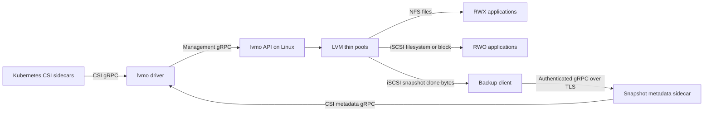

# lvmo-csi

LVM thin volumes for Kubernetes, exported over NFS or iSCSI through one CSI driver (`lvmo.csi.io`). Every PVC gets its own logical volume. NFS supports RWX filesystems; iSCSI supports RWO ext4/XFS filesystems and raw block devices. Snapshots and clones use LVM thin snapshots. The CSI SnapshotMetadata service exposes allocated and changed block ranges for KEP-3314.

This is an initial implementation for evaluation. It is a single storage server, with no replication or automatic failover. Kasten consumption of the metadata service is **not validated**.

## Architecture



The metadata path supplies byte ranges; the iSCSI clone supplies the corresponding bytes. Ordinary filesystem backups use filesystem clones and do not require the metadata sidecar.

## Build

Requires Go 1.26.3. Development scripts target macOS Apple Silicon with Lima, Kind, Helm, kubectl, and Docker CLI.

```sh
make build                    # Linux ARM64 executables in bin/
make test lint                # unit tests/race detector, vet, Helm lint
make release-binaries VERSION=v0.1.0  # Linux AMD64/ARM64 + SHA256SUMS
```

Generated bindings are committed. To regenerate, install `protoc`, `protoc-gen-go@v1.36.11`, and `protoc-gen-go-grpc@v1.5.1`, then run `make generate`.

## Storage server

Use a dedicated Linux server (tested with Ubuntu 24.04). Install `lvm2 thin-provisioning-tools nfs-kernel-server targetcli-fb open-iscsi xfsprogs`; enable NFS and the kernel LIO iSCSI target modules. Create a thin pool named `lvmo-pool` in each configured VG. The server deliberately does not repartition disks or create VGs in production.

```sh
sudo lvcreate --type thin-pool -L 100G --poolmetadatasize 1G -n lvmo-pool my-vg
sudo ./bin/lvmo-csi --server=10.0.0.10 -P 50051 my-vg
```

`lvmo-csi [-P port] VG...` automatically selects the local IPv4 address used by the default route. `--server` overrides the address Kubernetes nodes use for NFS/iSCSI; set it explicitly for multiple interfaces, NAT, or DNS-based access. `--root` defaults to `/var/lib/lvmo`; preserve this directory together with LVM metadata. `--pool` changes the thin pool name. `--nfs-clients` restricts the NFS export selector (default `*`). XFS requires a volume large enough for its minimum filesystem size (use at least 512Mi).

Restrict management TCP/50051, NFS TCP/2049, and iSCSI TCP/3260 to trusted cluster nodes. The management API and iSCSI targets intentionally have no authentication; NFS exports use `no_root_squash`. Do not expose these ports publicly. Monitor thin-pool data and metadata space: per-volume size enforcement does not reserve physical capacity, and pool exhaustion affects every volume sharing that pool. Configure LVM's devices file to include only backing PVs, particularly if the server is also an iSCSI initiator.

The API persists operation intents and deletion tombstones atomically. Incomplete creates are reclaimed by a background worker, allowing retries. Deleted NFS exports may retain kernel references temporarily; physical LV reclamation is retried. Only one API process may own a state directory.

## Kubernetes / OpenShift

Install the VolumeSnapshot CRDs and snapshot controller separately if your distribution does not already provide them. The chart does not own those prerequisites, StorageClasses, or VolumeSnapshotClasses.

```sh
helm upgrade --install lvmo charts/lvmo-csi -n lvmo-system --create-namespace \
  --set apiEndpoint=10.0.0.10:50051 \
  --set image.tag=v0.1.0
# Add --set openshift=true on OpenShift to install the driver's SCC.
kubectl apply -f tests/storageclasses.yaml  # example only: edit VG names first
```

Each real Kubernetes node needs a running host `iscsid`, an initiator name in `/etc/iscsi/initiatorname.iscsi`, NFS client support, and network access to the server. The privileged node plugin mounts host devices and the kubelet directory. `iscsiHostProc` is exclusively for nested Kind testing; leave it empty on real nodes.

StorageClass parameters: `protocol` (`nfs`, default, or `iscsi`), `vg` (required with multiple VGs), `filesystem` (`ext4`, default, or `xfs`), and optional `endpoint` (must match the deployment's API endpoint). One driver deployment manages one API endpoint. Restores across protocols must remain in the same VG and use the same driver identity. iSCSI staging takes a persistent, exclusive node lease; all iSCSI volumes are single-node. A different node cannot stage the volume until the previous node unmounts and releases it. There is no automatic failover or fencing of a failed host: before an operator releases a stranded lease through the management API, the old node must be stopped or otherwise prevented from accessing the target. NFS volumes retain multi-node access.

## Backups and changed block tracking

Ordinary filesystem snapshot restores remain the default. The optional block path creates an iSCSI `volumeMode: Block` PVC from a snapshot, including snapshots of NFS PVCs. It preserves the filesystem's raw bytes and never formats or mounts the backup clone. The VolumeSnapshotContent must permit filesystem-to-block conversion with `snapshot.storage.kubernetes.io/allow-volume-mode-change: "true"`.

See [validated capabilities and limits](docs/validation.md) and [metadata deployment and semantics](docs/metadata.md) for TLS, RBAC, discovery, independent verification, and Kasten configuration boundaries.

## End-to-end tests

```sh
scripts/e2e.sh                         # local; all suites, one setup/teardown
scripts/e2e.sh local sanity snapshots  # select suites
scripts/e2e.sh local metadata          # real full/incremental reconstruction
scripts/e2e.sh azure                   # active subscription + current OpenShift context
RELEASE_VERSION=v0.1.0 scripts/e2e.sh local metadata
```

Suites are `sanity`, `external`, `snapshots`, and `metadata`. Local runs create a uniquely named Lima VM, two loop-backed VGs, and Kind inside that VM. They do not change the host kubeconfig. `KEEP_TEST_ENV=true` retains a local VM for debugging. Reports are copied into `.test/reports` before teardown. Upstream external tests exclude disruptive, serial, slow, stress, and performance tests; unsupported capability cases are skipped by upstream.

Azure runs discover the current cluster's subnet, create a separate tagged resource group and Ubuntu VM, install this driver, and remove their resources afterward. They refuse to overwrite an existing lvmo installation. `AZURE_SUBNET_ID` overrides subnet selection. Setup uses Azure VM Run Command and a private temporary blob container, so it does not require a public VM IP or SSH access. Use an isolated test cluster: the upstream suite needs cluster-wide test permissions. The in-cluster test runner uses a temporary service account; your kubeconfig is never copied to the VM. By default Azure tests build the locally compiled AMD64 driver in the OpenShift internal registry. Set `RELEASE_VERSION` to test published artifacts instead.

## Releases and license

`make image VERSION=v0.1.0` publishes both Linux architectures using the current Docker authentication. `scripts/install-release.sh v0.1.0` downloads and verifies GitHub release binaries. GitHub Actions release publishing requires repository secrets `DOCKERHUB_USERNAME` and `DOCKERHUB_TOKEN`; local authenticated publishing does not require copying credentials into the repository.

Apache License 2.0: permissive reuse with an explicit patent grant.
