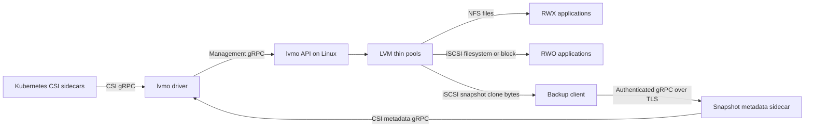
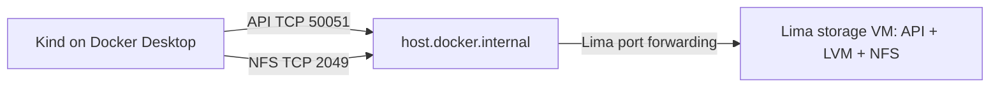

# lvmo-csi

LVM thin volumes for Kubernetes, exported over NFS or iSCSI through one CSI driver (`lvmo.csi.io`). Every PVC gets its own logical volume. NFS supports RWX filesystems; iSCSI supports RWO ext4/XFS filesystems and raw block devices. Snapshots and clones use LVM thin snapshots. The CSI SnapshotMetadata service exposes allocated and changed block ranges for KEP-3314.

This is an initial implementation for evaluation. Each volume resides on one storage server, with no replication or automatic failover. One driver installation can manage multiple servers. Kasten consumption of the metadata service is **not validated**.

## Architecture



The metadata path supplies byte ranges; the iSCSI clone supplies the corresponding bytes. Ordinary filesystem backups use filesystem clones and do not require the metadata sidecar.

### Why thin pools?

**Each PVC gets its own real logical volume (LV), with its own block device and capacity.** Filesystem volumes also have their own filesystem. You create a thin pool once during storage-server setup; the driver then creates each PVC's thin LV inside that pool automatically.

```text
Volume group: lvmo-data
└── Thin pool: lvmo-pool — shared backing storage
    ├── PVC A → its own thin LV → its own filesystem
    ├── PVC B → its own thin LV → its own filesystem
    └── PVC C → its own thin LV → raw block device
```

The pool is a special LVM logical volume that supplies physical blocks to these individual volumes. It is not a shared filesystem containing all PVCs as directories.

| Allocation model | What a 10 GiB PVC reserves |
| --- | --- |
| Traditional (thick) LV | 10 GiB of backing storage immediately from the volume group |
| Thin LV | A 10 GiB logical device; backing blocks are allocated from the pool as writes occur, including filesystem initialization |

We use thin LVs for three related capabilities:

- **Space allocation on demand:** each PVC has its own size limit without reserving its full capacity immediately.
- **Snapshots and clones:** an LVM thin snapshot initially shares its source's blocks. Subsequent writes allocate separate blocks, preserving the snapshot's contents without copying the entire volume.
- **Changed-block tracking:** the driver compares mappings from thin-pool metadata to identify allocated and changed byte ranges for CSI SnapshotMetadata, without scanning the entire volume's contents. See [metadata semantics](docs/metadata.md).

One thick LV per PVC is a valid storage design, but this driver requires thin pools. Supporting thick LVs would require a different implementation for snapshots, clones, and changed-block tracking.

The tradeoff is shared physical capacity: the sum of PVC sizes can exceed the pool's data capacity, and snapshots retain blocks that might otherwise be reclaimed. Monitor both pool data and metadata usage and extend the pool before either fills. A PVC's declared size does not guarantee that much free space in the pool; pool exhaustion can affect every volume using it.

## Build

Requires Go 1.26.3. Development scripts target macOS Apple Silicon with Lima, Kind, Helm, kubectl, and Docker CLI.

```sh
make build                    # Linux ARM64 executables in bin/
make test lint                # unit tests/race detector, vet, Helm lint
make release-binaries VERSION=v0.1.0  # Linux AMD64/ARM64 + SHA256SUMS
```

Generated bindings are committed. To regenerate, install `protoc`, `protoc-gen-go@v1.36.11`, and `protoc-gen-go-grpc@v1.5.1`, then run `make generate`.

## Storage server

Use a dedicated Linux server (tested with Ubuntu 24.04). Install `lvm2 thin-provisioning-tools nfs-kernel-server targetcli-fb open-iscsi xfsprogs`; enable NFS and the kernel LIO iSCSI target modules. Create a thin pool named `lvmo-pool` in each configured VG. The server deliberately does not repartition disks or create VGs in production.

```sh
sudo lvcreate --type thin-pool -L 100G --poolmetadatasize 1G -n lvmo-pool my-vg
sudo ./bin/lvmo-csi --server=10.0.0.10 -P 50051 my-vg
```

`lvmo-csi [-P port] VG...` automatically selects the local IPv4 address used by the default route. `--server` overrides the address Kubernetes nodes use for NFS/iSCSI; set it explicitly for multiple interfaces, NAT, or DNS-based access. `--root` defaults to `/var/lib/lvmo`; preserve this directory together with LVM metadata. `--pool` changes the thin pool name. `--nfs-insecure` allows NFS connections from unprivileged client source ports (default `false`); it applies to all NFS exports managed by this API, including exports regenerated on restart. It changes the source-port policy, not encryption, and does not affect gRPC or iSCSI. `--nfs-clients` restricts the NFS export selector (default `*`). XFS requires a volume large enough for its minimum filesystem size (use at least 512Mi).

Restrict management TCP/50051, NFS TCP/2049, and iSCSI TCP/3260 to trusted cluster nodes. The management API and iSCSI targets intentionally have no authentication; NFS exports use `no_root_squash`. Do not expose these ports publicly. Monitor thin-pool data and metadata space: per-volume size enforcement does not reserve physical capacity, and pool exhaustion affects every volume sharing that pool. Configure LVM's devices file to include only backing PVs, particularly if the server is also an iSCSI initiator.

The API persists operation intents and deletion tombstones atomically. Incomplete creates are reclaimed by a background worker, allowing retries. Deleted NFS exports may retain kernel references temporarily; physical LV reclamation is retried. Only one API process may own a state directory.

## Kubernetes / OpenShift

Install the VolumeSnapshot CRDs and snapshot controller separately if your distribution does not already provide them. The chart does not own those prerequisites, StorageClasses, or VolumeSnapshotClasses.

```sh
helm upgrade --install lvmo charts/lvmo-csi -n lvmo-system --create-namespace \
  --set image.tag=v0.1.0
# Add --set openshift=true on OpenShift to install the driver's SCC.
kubectl apply -f tests/storageclasses.yaml  # example only: edit endpoint and VG names first
```

Each real Kubernetes node needs a running host `iscsid`, an initiator name in `/etc/iscsi/initiatorname.iscsi`, NFS client support, and network access to the server. The privileged node plugin mounts host devices and the kubelet directory. `iscsiHostProc` is exclusively for nested Kind testing; leave it empty on real nodes.

StorageClass parameters: `endpoint` (required API host:port), `protocol` (`nfs`, default, or `iscsi`), `vg` (required with multiple VGs on that server), and `filesystem` (`ext4`, default, or `xfs`). One driver installation can manage several storage VMs:

```yaml
parameters:
  endpoint: storage-a.example.internal:50051
  protocol: iscsi
  vg: data
```

A second class can use `storage-b.example.internal:50051`. The endpoint selects the management API; that API supplies the NFS/iSCSI data address. CSI volume and snapshot handles retain their API endpoint, so node operations, expansion, deletion, restores, and CBT requests still route correctly after a driver restart. Use stable DNS names: changing a StorageClass does not retarget existing handles. The endpoint is also visible in the PV's `spec.csi.volumeAttributes.endpoint`.

The driver discovers backends for listing from StorageClasses, PV handles, and retained VolumeSnapshotContent handles. An unavailable backend returns an error for its operations; it does not prevent the driver from starting or provisioning against another backend. A combined list fails rather than silently omitting an unavailable backend. For restores across protocols, both classes must select the same canonical API endpoint, VG, and driver identity. Cross-server LVM cloning is not supported. The Helm `apiEndpoint` value is now only an optional fallback for legacy unqualified handles or standalone CSI tests.

iSCSI staging takes a persistent, exclusive node lease; all iSCSI volumes are single-node. A different node cannot stage the volume until the previous node unmounts and releases it. There is no automatic failover or fencing of a failed host: before an operator releases a stranded lease through the management API, the old node must be stopped or otherwise prevented from accessing the target. NFS volumes retain multi-node access.

## Backups and changed block tracking

Ordinary filesystem snapshot restores remain the default. The optional block path creates an iSCSI `volumeMode: Block` PVC from a snapshot, including snapshots of NFS PVCs. It preserves the filesystem's raw bytes and never formats or mounts the backup clone. The VolumeSnapshotContent must permit filesystem-to-block conversion with `snapshot.storage.kubernetes.io/allow-volume-mode-change: "true"`.

See [validated capabilities and limits](docs/validation.md) and [metadata deployment and semantics](docs/metadata.md) for TLS, RBAC, discovery, independent verification, and Kasten configuration boundaries.

## Deploy on your laptop: Kind with a separate Lima storage VM

This walkthrough installs a released driver into **Kind on Docker Desktop**, with **Lima used only as the storage server**. Kubernetes pulls `michaelcourcy/lvmo-csi` from Docker Hub. You do not need Go, a source checkout, or the project's test scripts.



The walkthrough creates an NFS RWX PVC, writes data, and restores a snapshot. It targets macOS Apple Silicon. The separate Docker Desktop/Lima topology has not yet been validated end to end; the earlier automated results used Kind inside Lima.

**Release artifacts:** `michaelcourcy/lvmo-csi:v0.1.0-alpha.2` is published on Docker Hub for Linux AMD64 and ARM64. The matching [GitHub release](https://github.com/michaelcourcy/lvmo-csi/releases/tag/v0.1.0-alpha.2) provides the Linux API binaries, checksums, and Helm chart used below.

### 1. Prepare your laptop and select a release

Install and start Docker Desktop. With Homebrew installed:

```sh
brew install lima kind kubectl helm
mkdir -p ~/lvmo-demo
cd ~/lvmo-demo
export LVMO_VERSION=v0.1.0-alpha.2
export LVMO_CHART_VERSION=0.1.0  # chart version listed in that release
export LVMO_RELEASE_URL="https://github.com/michaelcourcy/lvmo-csi/releases/download/$LVMO_VERSION"
export LVMO_VM=lvmo-storage
export LVMO_CLUSTER=lvmo-demo
export KUBECONFIG="$PWD/kubeconfig"

docker context use desktop-linux
docker info
limactl --version
kind version
docker pull "michaelcourcy/lvmo-csi:$LVMO_VERSION"
curl -fL "$LVMO_RELEASE_URL/lvmo-csi-$LVMO_CHART_VERSION.tgz" -o lvmo-csi.tgz
```

The image pull checks release availability before creating infrastructure; Kind will pull the same image from Docker Hub when Helm installs the driver. Public images do not require registry credentials. The dedicated `KUBECONFIG` keeps this walkthrough separate from your usual clusters. Run subsequent commands in this same terminal unless instructed to enter the VM.

### 2. Create the storage VM

Create this Lima configuration on the laptop:

```sh
cat > storage.yaml <<'YAML'
vmType: vz
cpus: 2
memory: 4GiB
disk: 30GiB
images:
- location: https://cloud-images.ubuntu.com/releases/noble/release/ubuntu-24.04-server-cloudimg-arm64.img
  arch: aarch64
mounts: []
containerd:
  system: false
  user: false
portForwards:
- guestPort: 50051
  hostPort: 50051
  hostIP: 127.0.0.1
  static: true
- guestPort: 2049
  hostPort: 2049
  hostIP: 127.0.0.1
  static: true
- guestPort: 3260
  hostPort: 3260
  hostIP: 127.0.0.1
  static: true
YAML
limactl start --name="$LVMO_VM" --tty=false storage.yaml
limactl shell "$LVMO_VM" sudo env LVMO_VERSION="$LVMO_VERSION" bash
```

**The next two steps run in this root shell inside Lima.** Kind remains on Docker Desktop; no Kubernetes components are installed in this VM.

Lima forwards the three ports onto the Mac's loopback interface. Kind reaches them through Docker Desktop's `host.docker.internal` address. Ports 50051, 2049 and 3260 must be free on the Mac. This uses [Lima port forwarding](https://lima-vm.io/docs/config/port/) and [Docker Desktop host access](https://docs.docker.com/desktop/features/networking/networking-how-tos/); the guest's default private IP is not used by Kind.

### 3. Install the storage API and prepare its pool

```sh
set -e
apt-get update
apt-get install -y lvm2 thin-provisioning-tools nfs-kernel-server targetcli-fb xfsprogs curl ca-certificates
modprobe dm_thin_pool
modprobe target_core_mod
modprobe iscsi_target_mod
systemctl enable --now nfs-server

mkdir -p /tmp/lvmo-release
cd /tmp/lvmo-release
LVMO_RELEASE_URL="https://github.com/michaelcourcy/lvmo-csi/releases/download/$LVMO_VERSION"
curl -fLO "$LVMO_RELEASE_URL/lvmo-csi-linux-arm64"
curl -fLO "$LVMO_RELEASE_URL/SHA256SUMS"
awk '$2 == "lvmo-csi-linux-arm64"' SHA256SUMS > api.sha256
test -s api.sha256
sha256sum --check api.sha256
install -m 0755 lvmo-csi-linux-arm64 /usr/local/bin/lvmo-csi

mkdir -p /var/lib/lvmo-disks
truncate -s 12G /var/lib/lvmo-disks/data.img
LVMO_LOOP=$(losetup --find --show /var/lib/lvmo-disks/data.img)
pvcreate "$LVMO_LOOP"
vgcreate lvmo-data "$LVMO_LOOP"
lvcreate --type thin-pool -L 10G --poolmetadatasize 128M -n lvmo-pool lvmo-data
lvs
```

The `lvcreate --type thin-pool` command above creates the shared pool, not a PVC volume. It allocates 10 GiB for data and 128 MiB for allocation metadata inside `lvmo-data`. The driver creates a separate thin LV for each PVC later; see [Why thin pools?](#why-thin-pools).

The loop-backed disk is a disposable demonstration disk created inside this VM. Run its creation commands once on the fresh VM. A real storage server should use a dedicated persistent disk or partition. This demo does not configure loop-device restoration after reboot; recreate the lab if you reboot it.

### 4. Start the API

Still inside Lima:

```sh
cat > /etc/systemd/system/lvmo-api.service <<'UNIT'
[Unit]
Description=LVMO storage API
Wants=network-online.target
After=network-online.target nfs-server.service
[Service]
ExecStart=/usr/local/bin/lvmo-csi --server=host.docker.internal --nfs-insecure -P 50051 lvmo-data
Restart=on-failure
[Install]
WantedBy=multi-user.target
UNIT
systemctl daemon-reload
systemctl enable --now lvmo-api
systemctl --no-pager status lvmo-api
exit
```

**You are now back on the laptop.** `--server=host.docker.internal` is the data address the API returns to the CSI node plugin. It deliberately names the endpoint reachable from Docker Desktop, rather than the VM's private address. The StorageClass will separately specify the management API's port.

### 5. Create Kind on Docker Desktop

```sh
kind create cluster --name "$LVMO_CLUSTER" --image kindest/node:v1.35.0 --wait 180s
kubectl get nodes

# Install NFS client tools in the Kind node.
docker exec "$LVMO_CLUSTER-control-plane" sh -c 'apt-get update && apt-get install -y nfs-common'
# Check the API route from that node before installing the driver.
docker exec "$LVMO_CLUSTER-control-plane" getent hosts host.docker.internal
docker exec "$LVMO_CLUSTER-control-plane" bash -c 'timeout 5 bash -c "echo > /dev/tcp/host.docker.internal/50051"'
```

The final command should exit successfully. If it fails, check `limactl list`, `limactl shell "$LVMO_VM" sudo systemctl status lvmo-api`, and local port conflicts before proceeding. NFS mounts also require NFS client support in the Docker Desktop Linux kernel; installing userspace tools cannot add a missing kernel feature.

### 6. Install snapshots and the released CSI driver

Run on the laptop:

```sh
export SNAPSHOTTER_VERSION=v8.5.0
for resource in volumesnapshotclasses volumesnapshotcontents volumesnapshots; do
  kubectl apply -f "https://raw.githubusercontent.com/kubernetes-csi/external-snapshotter/$SNAPSHOTTER_VERSION/client/config/crd/snapshot.storage.k8s.io_$resource.yaml"
done
for manifest in rbac-snapshot-controller.yaml setup-snapshot-controller.yaml; do
  kubectl apply -f "https://raw.githubusercontent.com/kubernetes-csi/external-snapshotter/$SNAPSHOTTER_VERSION/deploy/kubernetes/snapshot-controller/$manifest"
done
kubectl -n kube-system rollout status deployment/snapshot-controller --timeout=180s

kubectl create namespace lvmo-system
kubectl label namespace lvmo-system pod-security.kubernetes.io/enforce=privileged
helm upgrade --install lvmo ./lvmo-csi.tgz -n lvmo-system \
  --set image.repository=michaelcourcy/lvmo-csi \
  --set-string image.tag="$LVMO_VERSION" \
  --set image.pullPolicy=Always \
  --wait --timeout 5m
kubectl -n lvmo-system get pods
```

Leave `apiEndpoint` and `iscsiHostProc` unset. Each StorageClass selects its storage server; this deployment does not use the nested-Kind iSCSI helper.

```sh
kubectl apply -f - <<'YAML'
apiVersion: storage.k8s.io/v1
kind: StorageClass
metadata:
  name: lvmo-nfs
provisioner: lvmo.csi.io
allowVolumeExpansion: true
reclaimPolicy: Delete
parameters:
  endpoint: host.docker.internal:50051
  protocol: nfs
  vg: lvmo-data
---
apiVersion: snapshot.storage.k8s.io/v1
kind: VolumeSnapshotClass
metadata:
  name: lvmo-snapshots
driver: lvmo.csi.io
deletionPolicy: Delete
YAML
kubectl get sc lvmo-nfs -o yaml
```

For another storage VM, create another StorageClass pointing at its reachable API endpoint. With this forwarding layout, each additional VM needs distinct host ports and corresponding data-address configuration; production servers normally use their own directly reachable IPs or DNS names. Changing an existing StorageClass does not migrate existing volumes.

### 7. Write data to an NFS RWX PVC

The API service in step 4 uses `--nfs-insecure` for Lima's forwarded connections. Lima opens a new connection to the NFS server, which can use a source port above 1023. The default NFS `secure` policy rejects such ports; `insecure` permits them. This changes a source-port check, not encryption. See [NFS export options](https://www.man7.org/linux/man-pages/man5/exports.5.html).

The flag makes the API include `insecure` in every NFS export it manages, including new PVCs, restored PVCs, and existing exports regenerated on API restart. No per-PVC export edits are needed. Keep the tutorial's Mac listeners bound to `127.0.0.1`; for directly connected storage servers, leave the flag disabled unless this source-port allowance is required.

Create the PVC and pod:

```sh
kubectl create namespace lvmo-demo
kubectl -n lvmo-demo apply -f - <<'YAML'
apiVersion: v1
kind: PersistentVolumeClaim
metadata:
  name: data
spec:
  storageClassName: lvmo-nfs
  accessModes: [ReadWriteMany]
  resources:
    requests:
      storage: 1Gi
---
apiVersion: v1
kind: Pod
metadata:
  name: writer
spec:
  containers:
  - name: app
    image: busybox:1.37
    command: [sh, -c, 'sleep 86400']
    volumeMounts:
    - name: data
      mountPath: /data
  volumes:
  - name: data
    persistentVolumeClaim:
      claimName: data
YAML
kubectl -n lvmo-demo wait --for=condition=Ready pod/writer --timeout=180s
kubectl -n lvmo-demo exec writer -- sh -c 'echo "hello from lvmo" > /data/message; sync'
kubectl -n lvmo-demo exec writer -- cat /data/message
kubectl -n lvmo-demo get pvc
```

Expect a `Bound` PVC and the message `hello from lvmo`. To inspect the backend selected for the volume:

```sh
PV=$(kubectl -n lvmo-demo get pvc data -o jsonpath='{.spec.volumeName}')
kubectl get pv "$PV" -o jsonpath='{.spec.csi.volumeAttributes.endpoint}{"\n"}{.spec.csi.volumeHandle}{"\n"}'
```

### 8. Snapshot, restore, and verify the data

The demo has no active writer after the preceding `sync`. Applications with concurrent writes need their own quiescing or application-consistent backup procedure.

```sh
kubectl -n lvmo-demo apply -f - <<'YAML'
apiVersion: snapshot.storage.k8s.io/v1
kind: VolumeSnapshot
metadata:
  name: data-snapshot
spec:
  volumeSnapshotClassName: lvmo-snapshots
  source:
    persistentVolumeClaimName: data
YAML
kubectl -n lvmo-demo wait --for=jsonpath='{.status.readyToUse}'=true volumesnapshot/data-snapshot --timeout=180s
kubectl -n lvmo-demo exec writer -- sh -c 'echo "changed after snapshot" > /data/message; sync'

kubectl -n lvmo-demo apply -f - <<'YAML'
apiVersion: v1
kind: PersistentVolumeClaim
metadata:
  name: restored
spec:
  storageClassName: lvmo-nfs
  accessModes: [ReadWriteMany]
  resources:
    requests:
      storage: 1Gi
  dataSource:
    apiGroup: snapshot.storage.k8s.io
    kind: VolumeSnapshot
    name: data-snapshot
---
apiVersion: v1
kind: Pod
metadata:
  name: reader
spec:
  containers:
  - name: app
    image: busybox:1.37
    command: [sh, -c, 'sleep 86400']
    volumeMounts:
    - name: data
      mountPath: /data
  volumes:
  - name: data
    persistentVolumeClaim:
      claimName: restored
YAML
kubectl -n lvmo-demo wait --for=condition=Ready pod/reader --timeout=180s
kubectl -n lvmo-demo exec reader -- cat /data/message
kubectl -n lvmo-demo exec writer -- cat /data/message
```

The restored PVC should contain `hello from lvmo`; the original should contain `changed after snapshot`.

### 9. Troubleshoot and remove the installation

Run these diagnostics from the laptop:

```sh
kubectl -n lvmo-demo get pvc,pods,volumesnapshots
kubectl -n lvmo-demo describe pod writer
kubectl -n lvmo-system logs deployment/lvmo-controller -c driver --tail=100
kubectl -n lvmo-system logs daemonset/lvmo-node -c driver --tail=100
kubectl get events -A --sort-by=.lastTimestamp
limactl shell "$LVMO_VM" sudo journalctl -u lvmo-api --no-pager -n 100
limactl shell "$LVMO_VM" sudo lvs
```

`ImagePullBackOff` requires checking the published tag and registry access. A pending PVC calls for checking the StorageClass API endpoint; a bound PVC with a pod stuck mounting calls for checking NFS connectivity on port 2049 and the node's kernel support. Docker Desktop/Lima forwarding and sleep/wake can affect connections; this is a laptop lab, not a highly available storage deployment.

To remove the demo, delete its resources while the CSI driver and storage VM are still running:

```sh
kubectl delete namespace lvmo-demo --wait=true --timeout=180s
kubectl get pv
kubectl get volumesnapshotcontent
```

Wait for this demo's PVs and snapshot contents to disappear. NFS delegations can delay physical LV reclamation after Kubernetes resources disappear; inspect `lvs` and the API logs if needed. See [the known reclamation limitation](docs/validation.md).

Then remove the dedicated cluster and VM. This destroys all data in this lab:

```sh
helm uninstall lvmo -n lvmo-system
kind delete cluster --name "$LVMO_CLUSTER"
limactl delete --force "$LVMO_VM"
unset KUBECONFIG
```

### About iSCSI and block backups on this topology

The driver also supports iSCSI and NFS-snapshot-to-block backup clones. Those paths additionally require a working iSCSI initiator and kernel support on each Kind node. On macOS, that kernel belongs to Docker Desktop, not Lima; installing `iscsid` on the storage VM does not supply the initiator for Kind. This guide therefore demonstrates NFS and ordinary filesystem snapshot restores. iSCSI/CBT on this separate Docker Desktop/Lima layout remains unvalidated; do not interpret the nested-Lima test results as validation of this layout. See [metadata deployment](docs/metadata.md) for the backup service requirements.

## Developer end-to-end tests

These commands are for contributors. They build local code and use a different topology (Kind inside Lima); they are not part of the release-based deployment guide above.

```sh
scripts/e2e.sh                         # local; all suites, one setup/teardown
scripts/e2e.sh local sanity snapshots  # select suites
scripts/e2e.sh local metadata          # real full/incremental reconstruction
scripts/e2e.sh azure                   # active subscription + current OpenShift context
RELEASE_VERSION=v0.1.0 scripts/e2e.sh local metadata
```

Suites are `sanity`, `external`, `snapshots`, and `metadata`. Local runs create a uniquely named Lima VM, two loop-backed VGs, and Kind inside that VM. They do not change the host kubeconfig. `KEEP_TEST_ENV=true` retains a local VM for debugging. Reports are copied into `.test/reports` before teardown. Upstream external tests exclude disruptive, serial, slow, stress, and performance tests; unsupported capability cases are skipped by upstream.

Azure runs discover the current cluster's subnet, create a separate tagged resource group and Ubuntu VM, install this driver, and remove their resources afterward. They refuse to overwrite an existing lvmo installation. `AZURE_SUBNET_ID` overrides subnet selection. Setup uses Azure VM Run Command and a private temporary blob container, so it does not require a public VM IP or SSH access. Use an isolated test cluster: the upstream suite needs cluster-wide test permissions. The in-cluster test runner uses a temporary service account; your kubeconfig is never copied to the VM. By default Azure tests build the locally compiled AMD64 driver in the OpenShift internal registry. Set `RELEASE_VERSION` to test published artifacts instead.

## Releases and license

`make image VERSION=v0.1.0` publishes both Linux architectures using the current Docker authentication. `scripts/install-release.sh v0.1.0` downloads and verifies GitHub release binaries. GitHub Actions release publishing requires repository secrets `DOCKERHUB_USERNAME` and `DOCKERHUB_TOKEN`; local authenticated publishing does not require copying credentials into the repository.

Apache License 2.0: permissive reuse with an explicit patent grant.
